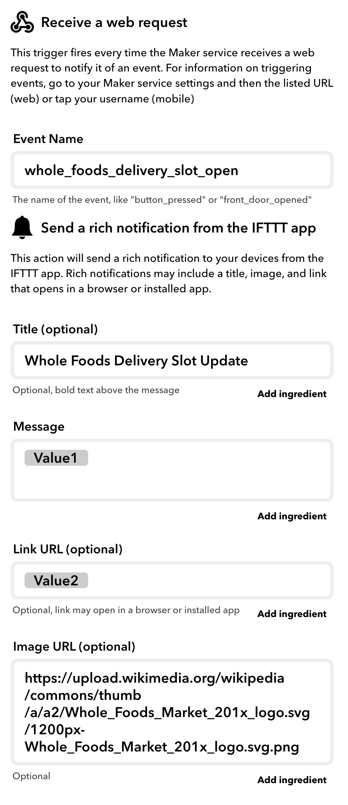

- [Whole Foods and Amazon Fresh Delivery Slot Automated Script](#whole-foods-and-amazon-fresh-delivery-slot-automated-script)
  * [Usage:](#usage)
    + [After you clone the project:](#after-you-clone-the-project)
 - [Visual Aid](#visual-aid)

# Whole Foods and Amazon Fresh Delivery Slot Automated Script

Yes, amid COVID-19 trying to get Whole Foods and Amazon Fresh delivery slots can get cumbersome. To free you of the constant hassle of checking for slots (and almost never finding one), this automated script will check at a (configurable) random interval and notify you when new delivery slots open.

Speech notifications currently only work on macOS and push notifications use [IFTTT](https://ifttt.com)'s webhook functionality.

## Usage:
This script initializes a webdriver, which can be installed via homebrew ```$ brew install gecko driver``` or downloaded from here: https://github.com/mozilla/geckodriver/releases.

If the driver is not installed as ```/usr/local/bin/geckodriver``` (homebrew default), you'll need to pass in the path via your run.py script.

Script runs on Python 3.6+ and there are no plans to expand support beyond Firefox.

_The script works after you have added all the items to your cart! Note, have your cart ready before running this script! Also, please don't let your computer sleep._

### After you clone the project:
_Walkthrough for script_

1. (Optional) Create and activate a python3 virtual environment (or do so with anaconda).
2. Run the requirements.txt ```$ pip install -r requirements.txt``` (Use ```pip3``` if not using a virtual environment)
3. Create IFTTT [webhook](https://ifttt.com/maker_webhooks) for notifications:

</img>

4. Create a ```run.py``` script in the same directory as ```whole_foods_delivery_slot_firefox.py```:

``` python
#!/usr/bin/env python3

import whole_foods_delivery_slot_firefox as wfds

IFTTT_WEBHOOK_NAME = "whole_foods_delivery_slot_open"
IFTTT_WEBHOOK_KEY = "abcdefg1234567"


if __name__ == "__main__":
    ds = wfds.WholeFoodsDeliverySlot(IFTTT_WEBHOOK_NAME, IFTTT_WEBHOOK_KEY, firefox_driver_path="only/if/not/usr/local/bin")
    ds.main()
```
You can find your webhook key by going [here](https://ifttt.com/maker_webhooks/settings). You can pull it from the displayed URL: ```https://maker.ifttt.com/use/{WEBHOOK_KEY_IS_HERE}```.

5. Run your new run.py script ```$ python3 run.py``` and follow the prompts.
6. Get a nice warm Tea, browse reddit, do something on Xbox, etc.
7. Once a slot opens the script will notify you of an open slot.
8. Proceed to checkout once you select a time slot. Stay Safe!

# Visual Aid

> __Screen 1__


> __Screen 2__


> __Screen 3__


> __Screen 4__


> __Screen 5: Leave script running on this screen!__

